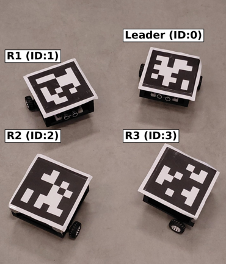
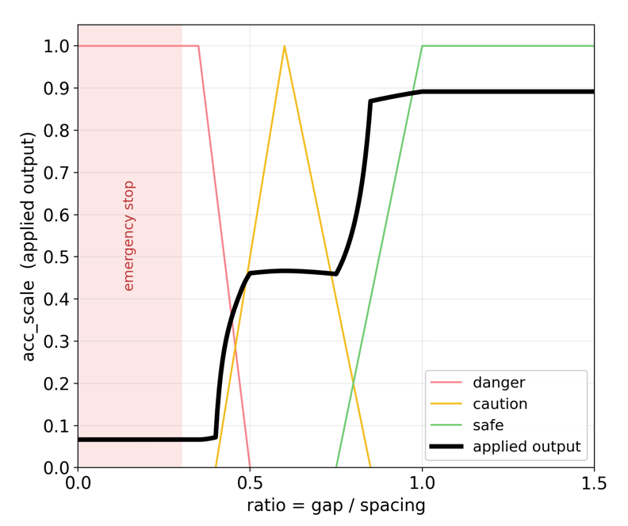
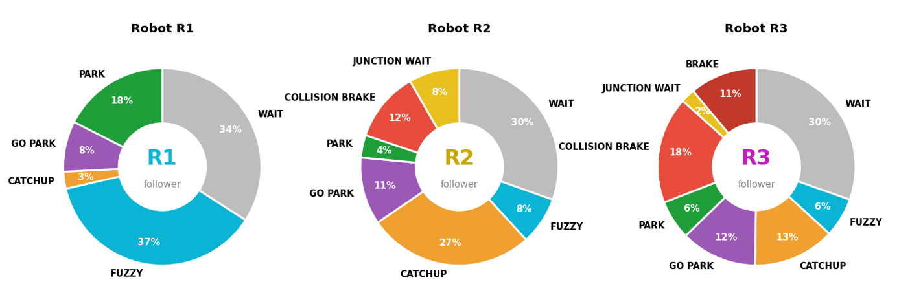
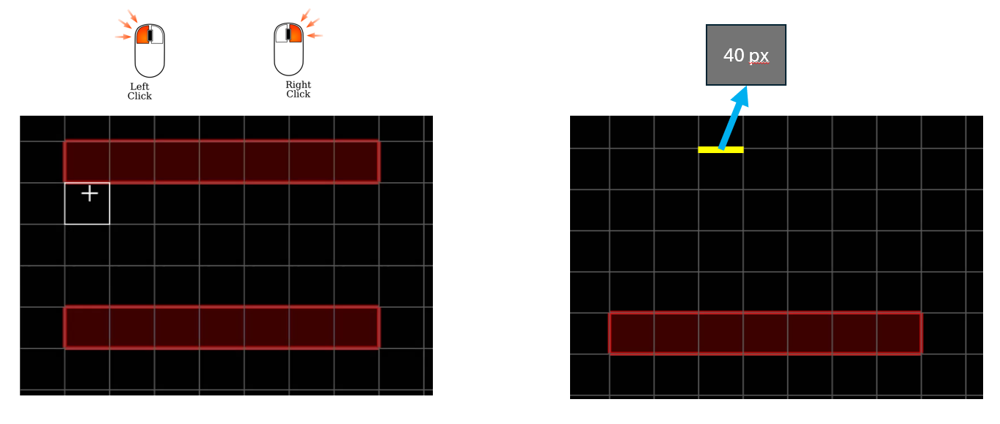

<div align="center">
  
# Adaptive Formation Control For Collaborative Swarm Robots 🤖🛰️
**Istanbul Bilgi University | Mechatronics Engineering Department**

*Developed by: Emir Bekar, Berkay Vatansever | Advisor: Yeşim Öniz*

<br>

<p align="center">
  
</p>

</div>

## 🎯 Objective
The primary goal of this project is to design an adaptive formation control system so a swarm of simple, decentralized mobile robots can move together collectively, navigate dynamic environments, and automatically adapt their formation geometry based on spatial constraints like narrow corridors or obstacles.

---

## ⚙️ Hardware Components
Each swarm agent is designed from scratch, utilizing a custom 3D-printed chassis and integrated electronics for real-time responsiveness.
* **Microcontroller:** ESP32 (Optimized to 80MHz for thermal efficiency and zero packet loss)
* **Motor Driver:** TB6612FNG Dual Motor Driver
* **Actuators:** N20 Micro Gear Motors & Caster Wheel
* **Power:** 2x 18650 Li-ion Batteries (2000 mAh) with LM2596 Voltage Regulator
* **Localization:** Top-mounted AprilTag (tag36h11) for absolute positioning

---

## 🧠 System Architecture & Control Flow

The architecture eliminates the need for expensive onboard sensors by shifting heavy computations to a central PC, while maintaining localized autonomy for hardware execution.

1. **Perception Layer:** An overhead Samsung S24 smartphone streams the arena at 720p/30fps. `pupil_apriltags` extracts the Pose (x, y, θ) of each robot in real-time.
2. **Main Controller (Python):** Processes the vision data, filters camera noise using a Constant Velocity **Kalman Filter** (handling occlusions predictively), and computes navigation vectors.
3. **Wireless Communication:** A dedicated Type-C Gateway ESP32 translates Python serial strings into raw hex and broadcasts PWM commands to the swarm via the **ESP-NOW** protocol for zero-latency (<2ms) execution.

---

## 🔄 Swarm Intelligence: Adaptive Formation & Fuzzy Logic

Instead of rigid PID controllers that cause stuttering, we implemented **Fuzzy Logic** to dictate the speed (`acc_scale`) and structural integrity of the swarm. The formation dynamically switches based on environmental width:

### 1. Line Formation & Adaptive Cruise Control (ACC)
When the swarm detects a narrow corridor, it collapses into a single-file Line formation (R3 → R1 → R2). To prevent the "accordion effect" (stop-and-go waves):
* **Input Ratio:** Calculated as `gap / FORMATION_SPACING`. The target slot gap is strictly `0.55 * Spacing` behind the robot ahead.
* **Fuzzy Evaluation:** The ratio passes through membership functions: **Danger (0-0.50), Caution (0.40-0.85), and Safe (0.75-1.0)**.

<p align="center">
  
</p>

* **Speed Output:** The controller outputs a smooth scaling factor: **Stop, Slow, or Fast**.
* **Failsafe:** An emergency brake is triggered if the ratio drops below `0.30` (~66px) to prevent physical ramming.

### 2. Triangle Formation & Centroid Cohesion
In open areas, two robots smoothly transition to the side slots of the leader’s path. Since side robots don't have a direct leader in front of them, ACC is replaced by a Cohesion system:
* **Center of Mass (COM):** The system continuously calculates the swarm's COM: `((x1+x2+x3)/3 , (y1+y2+y3)/3)`.
* **Cohesion Logic:** A centroid-offset fuzzy logic monitors each robot's position. If the apex robot rushes too far ahead of the COM, the fuzzy controller scales down its speed to a "crawl" state, forcing it to wait for the trailing robots to catch up, ensuring perfect lateral alignment.

### 3. Steering Branch (Adaptive Pure-Pursuit)
* **Path Tracking:** Robots track paths using Pure-Pursuit, but the "lookahead" distance is dynamically adaptive.
* **Cross-Track Correction:** If a robot deviates from the path, a dedicated fuzzy set shortens the lookahead distance, forcing an aggressive and tight return to the trajectory without corner-cutting.
* **Artificial Potential Fields (APF):** Creates repulsive vortex vectors around virtual walls and other robots, guiding agents smoothly around obstacles without coming to a sudden halt.

---

## 📊 Results and Data Analysis

The system was rigorously tested across various obstacle courses, including S-curves, junction merges, and final parking slots.

<p align="center">
  
</p>

**Key Telemetry Highlights:**
* **Path Efficiency:** Achieved up to `0.96` net/gross path efficiency for the leader navigating complex mazes.
* **Collision Avoidance:** `0.0%` physical collisions during the full-course runs. The APF and collision brake systems successfully mitigated all impacts.
* **Tag Reliability:** Maintained a `100%` AprilTag detection rate throughout the runs.
* **Task Distribution:** Detailed state analyses (Pie Charts) proved that Fuzzy ACC and Cohesion logic actively handled speed scaling for over `37%` of the mission time, practically eliminating idle stops.

---

## 🎮 Custom Parkour Editor (Sim-to-Reality)
To test algorithms before physical deployment, the Python backend includes a built-in, Minecraft-style grid editor to design custom physical courses directly on the camera feed. 

<p align="center">
  
</p>

* **[Left Click]:** Paint a 40x40px obstacle block.
* **[Right Click]:** Erase block.
* Obstacles are instantly merged into larger bounding boxes for optimized visibility graph routing (Dijkstra) and wall-repulsion calculations.

---

## 🎥 Live Demo & Full Course Run

Watch the complete autonomous run where the swarm navigates with applied fuzzy, handles narrow corridors via Adaptive Formation, and completes perfect precision parking.

<p align="center">
  <a href="https://youtu.be/iFn0FmXGxuo">
    
  </a>
</p>

<p align="center">
  <em>Click the badge above to watch the full system demonstration on YouTube.</em>
</p>

---

## 🚀 Quick Start & Installation

### Requirements
Ensure you have Python 3.8+ installed. Install the core dependencies:
```bash
pip install opencv-python numpy scikit-fuzzy pupil-apriltags pyserial
